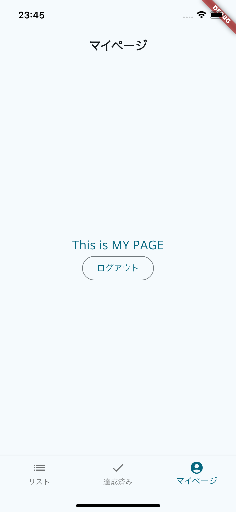

# bucket_list_app

- 「死ぬまでにやりたい 100 のこと」を登録するアプリ

> [!CAUTION]
> 2024/03/29時点での実装状況を記載

## 使用ライブラリ

- riverpod(v2.0)
- flutter_hooks
- go_router

## 画面仕様

**ログイン画面**
- 未ログインのユーザーに表示する
- アカウント作成済みの場合はログイン
- アカウント未作成の場合は新規作成
- パスワードはデフォルトで非表示にする
  - ボタンタップで表示/非表示の切り替え可能

| ログイン                       | 新規登録                       |
| ------------------------------ | ------------------------------ |
|  |  |

---

**リスト画面**
- タブで表示内容を切り替えられる
  - 一覧タブ
  - カテゴリタブ
  - やりたい度タブ
- ボトムナビゲーションで画面を切り替えられる
  - 達成済みタブタップで達成済みリスト画面に遷移
  - マイページタブタップでマイページ画面に遷移
- 右上「+」ボタンタップで詳細画面へ遷移

| 一覧タブ                                  | カテゴリタブ                                  | やりたい度タブ                                  |
| ----------------------------------------- | --------------------------------------------- | ----------------------------------------------- |
|  |  |  |

---

**詳細画面**
- リストに表示するアイテムを登録する
- 登録機能は未実装

---

**達成済みリスト画面**
- 未実装

---

**マイページ画面**
- ログアウトボタンタップでログアウト可能

## Figma
> [!NOTE]
> 実装前に作成したもの
> 一部デザインは実装をしながら修正している

  
